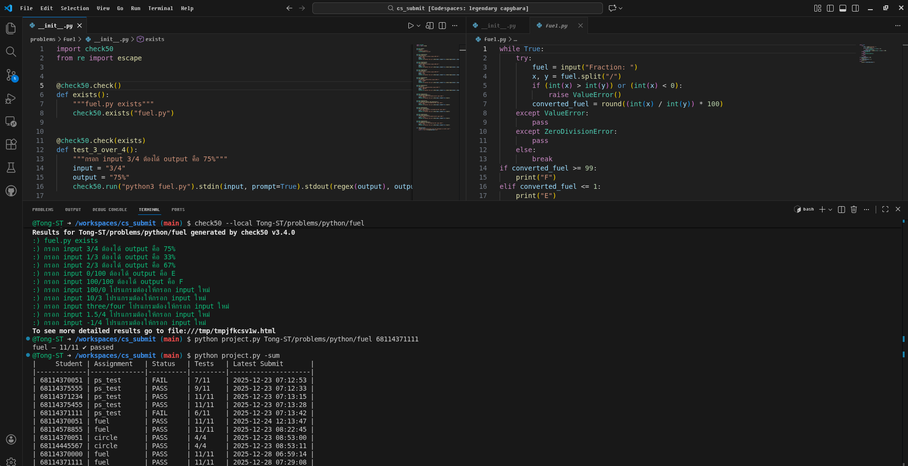

# CS SUBMIT - The implementation of Check50 Tools for autograding on code assignment
#### Video Demo: [CS SUBMIT demo](https://youtu.be/_2CjOsBbmfw)
This project is build to expand the use of CS50 code assignment checking tool call [check50](https://cs50.readthedocs.io/projects/check50/en/latest/)

Me as a currently CS student also Teacher Assistant, I found out somethime on code assignment, We still have to manual check student code for grading, it's time consuming process

So, I decide to implement on an exellent tools from CS50 couses that we use all the time check50, submit50

check50 is well-document and opensource, We just need to find the way to integrate for our own use-case such as where to submit and make it user friendly as much as possible

## Demo
Developing stage, still on CLI

## Development Stage
[/] Basic function of create check using check50

[/] Build and test my own submit functionality

[ ] Build Web-application to manage student score system easily

[ ] Build custom codespace IDE for CS50 learning environment model

[ ] Connect with AI-Agent to help teacher/TA create check more easily  

[ ] Create documentation page when I have MVP

This project still very early in development, But i will keep updating

## Using AI to create check50
In this project I use gemini, it's free to get started and test
- To run `python check_gen.py`
- Requirements `google-genai`, `dotenv` for API KEY
- See an official [Google AI API doc](https://ai.google.dev/gemini-api/docs/quickstart)
- In your .env file ADD `GEMINI_API_KEY="YOUR_GEMINI_API_KEY"`

## Reference
- My other problem repo [python check](https://github.com/Tong-ST/problems/python) That contain check for testing
- An official [CS50 Check](https://github.com/cs50/problems) contain all the check that we can use as references

## Thanks
- Thanks to all CS50 Teacher and Preceptor
- This [CS50P](https://cs50.harvard.edu/python/) python couse
- Thanks for [CS50 Docuementation](https://cs50.readthedocs.io/)